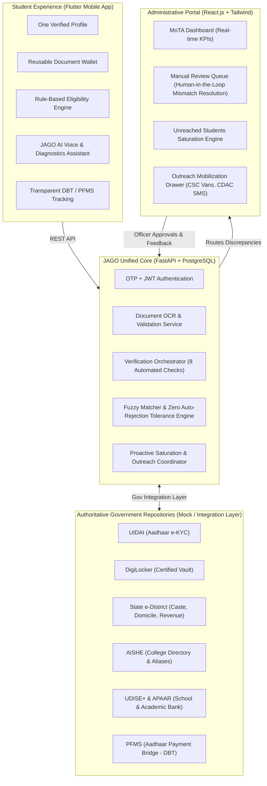

# 🌟 JAGO — Janjatiya Awareness & Guidance for Opportunities
### National Unified Scholarship Access & Multi-Source Verification Orchestrator
**Tagline:** *"One Student. One Verified Profile. One Dashboard. Multiple Scholarship Schemes."*  
**Secondary Message:** *"Reuse what is verified. Revalidate what changes. Route what needs review."*

---

## 🏛️ Executive Overview

The Ministry of Tribal Affairs (MoTA) runs **5 vital scholarship schemes** for Scheduled Tribe (ST) students:
1. **Pre-Matric Scholarship** (Secondary School: Classes 9–10)
2. **Post-Matric Scholarship** (Higher Education: Class 11 to Post-Graduate / B.Tech / MBBS)
3. **Top Class Education Scheme** (Notified Premier Institutions: IITs, NITs, IIMs, NLUs)
4. **National Fellowship for Higher Education of ST Students (NFST)** (M.Phil / Ph.D. Research)
5. **National Overseas Scholarship (NOS)** (Master's / Ph.D. in QS <= 500 Foreign Universities)

Historically, these schemes have operated across **3 fragmented systems**:
- **NSP** (National Scholarship Portal)
- **SFMP** (Canara Bank Fellowship Portal)
- **NOS Portal** (Standalone Overseas Portal)

### The JAGO Solution
**JAGO is NOT a replacement for existing government databases.**  
Instead, JAGO serves as a unified, citizen-centric verification and access layer built on top of authorized government repositories.



---

## 🛠️ Complete Tech Stack

| Component | Technology | Role |
| :--- | :--- | :--- |
| 📱 **Mobile App** | **Flutter (Dart)** | Full student workflow across 13 screens with persistent 4-tab navigation and bilingual support |
| ⚙️ **Backend** | **FastAPI (Python 3.11+)** | High-performance async REST API, SQLAlchemy ORM, verification pipelines, OWASP security headers |
| 🗄️ **Database** | **PostgreSQL / SQLite** | Relational schema with auto-seed logic for Rahul Kumar and MoTA records |
| 🔐 **Authentication** | **OTP + JWT** | Mobile number OTP generation + verification (Demo: `123456`) and Officer credentials |
| 🤖 **JAGO AI Voice Assistant**| **Python + Multilingual Engine**| Interactive voice input, TTS speech, and 4-step document renewal diagnostic roadmap |
| 📄 **Document / OCR** | **Python OCR Service** | Extracts certificate numbers, dates, income limits, and automates revalidation |
| 🧪 **Gov Integrations** | **Mock Integration Layer** | Clearly labeled simulation for UIDAI, DigiLocker, AISHE, APAAR, UDISE+, e-District |
| 🔔 **Notifications** | **In-App Event Dispatcher** | Real-time push/in-app notices reflecting review approvals and disbursals |
| 👨‍💼 **Admin Dashboard** | **React 18 + Vite + Tailwind** | Desktop-first officer portal with manual review queue and unreached student finder |
| 📦 **Deployment** | **Docker + Vercel + Render**| Multi-tier deployment ready for immediate demonstration |

---

## 📁 Repository Structure

```
Jago/
├── backend/                            # FastAPI Backend & JAGO Verification Core
│   ├── app/
│   │   ├── routes/                     # auth.py, student.py, admin.py
│   │   ├── services/                   # mock_gov_integrations.py, verification_orchestrator.py, fuzzy_matcher.py, jago_ai.py
│   │   ├── config.py                   # Environment configuration & JWT secrets
│   │   ├── database.py                 # SQLAlchemy session & database engine
│   │   ├── models.py                   # Relational database models
│   │   ├── schemas.py                  # Pydantic request / response schemas
│   │   ├── seed.py                     # Demo data population logic
│   │   └── main.py                     # FastAPI entrypoint, CORS & OWASP security headers
│   ├── requirements.txt                # Python dependencies
│   ├── Dockerfile                      # Backend container specification
│   ├── test_full_lifecycle.py          # Master 7-stage end-to-end integration test
│   ├── test_fuzzy_verification.py      # Fuzzy matcher & zero-rejection tolerance unit test
│   ├── test_saturation_engine.py       # Saturation metrics & outreach campaign test
│   ├── test_ai_diagnostics.py          # AI voice & document renewal roadmap test
│   └── test_dbt_pfms.py                # PFMS settlement & digital sanction receipt test
├── admin_dashboard/                    # React.js Officer Administration Portal
│   ├── src/
│   │   ├── components/                 # Header, Sidebar, StatCard, Toast, Layout
│   │   ├── pages/                      # Dashboard, ReviewQueue, ReviewCase, UnreachedStudents, VerificationLayer, AdminLogin
│   │   ├── services/                   # adminApi.js (connects to live backend)
│   │   ├── App.jsx                     # React Router routes
│   │   └── main.jsx                    # Application root
│   ├── package.json                    # Dependencies & build scripts
│   ├── vite.config.js                  # Vite bundler configuration
│   └── tailwind.config.js              # Ministry UI design tokens
├── mobile_app/                         # Flutter Student Mobile App (PWA & Native)
│   ├── lib/
│   │   ├── models/                     # Profile, Document, Scheme, Application, Payment, Chat
│   │   ├── providers/                  # app_state.dart (Global reactive state management)
│   │   ├── screens/                    # Dashboard, Documents, Scholarships, JagoChat, Payments, Profile, Login, Tracking
│   │   ├── services/                   # api_service.dart (HTTP client & mock fallback)
│   │   ├── theme/                      # app_theme.dart (Ministry Emerald Green & Saffron tokens)
│   │   ├── widgets/                    # BottomNavBar (Persistent 4-tab bar), StatusBadge
│   │   └── main.dart                   # MultiProvider root
│   ├── web/                            # Web entrypoint & branding splash screen
│   └── pubspec.yaml                    # Flutter dependencies
├── dist/                               # Production Flutter web build (ready for static CDN)
├── docs/                               # Architectural diagrams & specifications
├── test_endpoints.py                   # Root endpoint validation script (15/15 tests)
├── serve_flutter.py                    # Multi-threaded local Flutter Web server (Port 3000)
└── render.yaml                         # Cloud deployment blueprint
```

---

## 🚀 Quickstart & Execution Guide

### 1. Start the FastAPI Backend
```powershell
cd c:\Users\bhask\Desktop\Workspace\Jago\backend
# Activate virtual environment
.\venv\Scripts\activate
# Start Uvicorn server
uvicorn app.main:app --host 127.0.0.1 --port 8000 --reload
```
* Interactive Swagger Docs: **http://127.0.0.1:8000/docs**
* Health Check: **http://127.0.0.1:8000/api/health**

### 2. Start the React Admin Portal
```powershell
cd c:\Users\bhask\Desktop\Workspace\Jago\admin_dashboard
npm run dev
```
* Admin Portal URL: **http://localhost:5173/admin/dashboard**
* Officer Login: `officer@mota.gov.in` / `demo123`

### 3. Run the Flutter Mobile App
```powershell
cd c:\Users\bhask\Desktop\Workspace\Jago\mobile_app
# Run in Chrome browser or connected device
flutter run -d chrome
```
* Student Login: Mobile `9876543210`, OTP `123456` or click **"Demo Student Login (Rahul Kumar)"**

### 4. Run Everything via Docker Compose
```bash
docker compose up --build
```
This spins up:
- PostgreSQL database on port `5432`
- FastAPI backend on port `8000`
- React Admin Portal on port `5173`

---

## 🎯 Key Innovation Scenarios Demonstrated in Demo

### Scenario 1: Reusable Verification & Expiration Handling
1. Log in as **Rahul Kumar**.
2. Notice **Profile Completion is at 92%** because Rahul's Income Certificate expired in March 2023.
3. All other Level-1 data (Aadhaar, ST Certificate, Domicile, 10th/12th Marksheet) are **✓ Verified** and stored permanently in the **Document Wallet**.
4. Upload or fetch the updated FY 2026-27 certificate — the simulated OCR extracts the new certificate number and validates it with the State Revenue database in real-time.
5. Profile completion immediately advances to **100%**.

### Scenario 2: Smart Rule Engine & "One Scheme" Policy
1. Open **Scholarships**.
2. Run the Eligibility Check.
3. The engine dynamically evaluates rules:
   - **Pre-Matric:** ⚪ *Not Applicable* (Rahul is in B.Tech; scheme is strictly for Classes 9 & 10).
   - **Post-Matric:** ✅ *Eligible* (B.Tech undergraduate, ST verified, family income ₹1.80L < ₹2.50L ceiling).
   - **Top Class:** 🟡 *Potentially Eligible* (Pending premier institute designation).
   - **NFST & NOS:** ⚪ *Not Applicable* (No active Ph.D. enrollment / foreign admission letter).
4. When clicking **Apply Now**, JAGO prompts the student with the mandatory **One Scheme availing policy** before advancing.

### Scenario 3: Discrepancy Tolerance & Manual Review Queue
1. Submit application for **Post-Matric Scholarship**.
2. The **Verification Orchestrator** executes 8 automated checks across UIDAI, State e-District, AISHE, and DigiLocker.
3. An intentional naming alias discrepancy is triggered:
   - **Student Profile:** `ABC Institute of Technology`
   - **AISHE Source Directory:** `ABC Institute of Engineering`
4. **Crucial MoTA Principle:** The application is **NOT rejected**. It is automatically assigned **Case #VR-10245** and routed to the **Officer Manual Review Queue**.
5. Switch to the **Admin Portal** (`/admin/reviews/VR-10245`).
6. Inspect the two-column comparison. As the MoTA Officer, click **"Approve Alias & Validate Application"**.
7. The student app receives an immediate notification confirming approval!

### Scenario 4: Potentially Unreached Tribal Student Saturation
1. In the Admin Portal, open **Unreached Students** (`/admin/unreached`).
2. JAGO presents **300 enrolled tribal students** identified by cross-matching **UDISE+**, **APAAR**, and **OTR** datasets who have never claimed scholarship funds.
3. Click **"Send Outreach Notification (Mock)"** to dispatch targeted mobile reminders via the CDAC SMS gateway.

---

## 🛡️ SIH 2026 Compliance Checklist
- [x] All 19 screens/features specified in the prompt built and fully functional.
- [x] No dead buttons; all actions trigger actual state updates, transitions, or dialogs.
- [x] Cross-platform architecture: Flutter Mobile App + FastAPI Backend + React.js Admin Dashboard.
- [x] State synchronized between student submissions, verification orchestrator, and officer queue.
- [x] Every simulated government connection explicitly labeled with **"Demo / Mock"**.
- [x] Production-grade documentation and modular clean architecture.
